<script> 
    $(document).ready(function() { 
    $head = $('#header'); 
    $head.prepend('<A href = https://www.cuttingedge-events.com></A>') 
    }); 
</script> 


```{r setup, include=FALSE}
knitr::opts_chunk$set(echo = FALSE, message=FALSE, warning=FALSE)
```


```{r libraries}
library(readxl)
library(dplyr)
library(knitr)
library(timevis)

```

## Accommodation

### _**Main Hotel: Hotel Majestic**_

<iframe src="Majestic/Majestic.html" frameborder="0" width="100%" height="1550" scrolling="no"></iframe>

<div class="budget">

<p> Accomodation. 
  <ul>
   Twin room. Rates per room per night. Including breakfast buffet: 355€ per night VAT inc.
   
   Double room for a single use (VIP). Rates per room per night: 330€ per night VAT inc.
   
   Touristic tax: 2,48€ VAT inc per person and night.
  </ul>
</p>
<p> F&B. 
  <ul>
   Lunch / dinner menu: rates from 60€ per person.
  </ul>
</p>

</div>

<style>

.budget{
background-color: #607D8B;
color: white;
padding: 10px;
border: 1px solid black;
margin-left: 5px;
border-radius: 5px;
font-style: italic;
}
</style>

### **Alternative Hotels** {.tabset .tabset-fade .tabset-pills}

#### El Palace

<iframe src="El Palace/El Palace.html" frameborder="0" width="100%" height="1700" scrolling="no"></iframe>

<div class="budget">

<p> Accomodation.
  <ul>
   Twin room. Rates per room per night. Including breakfast buffet: 425€ per night VAT inc.
   
   Double room for a single use (VIP). Rates per room per night: 405€ per night VAT inc.
   
   Touristic tax: 2,48€ VAT inc per person and night.
  </ul>
</p>
<p> F&B.
  <ul>
    Lunch / dinner menu: rates from 52€ per person.
    
   Gala menu: rates from 94€ per person.
  </ul>
</div>

#### Casa Fuster

<iframe src="Casa Fuster/Casa Fuster.html" frameborder="0" width="100%" height="1600" scrolling="no"></iframe>

<div class="budget">

<p> Accomodation.
  <ul>
   Twin room. Rates per room per night. Including breakfast buffet: 370€ per night VAT inc.
   
   Double room for a single use (VIP). Rates per room per night: 340€ per night VAT inc.
   
   Touristic tax: 2,48€ VAT inc per person and night.
  </ul>
</p>
<p> F&B.
  <ul>
    Lunch / dinner menu: rates from 51€ per person.
    
   Gala menu: rates from 68€ per person.
  </ul>
</div>

#### H10 Metropolitan

<iframe src="H10 Metropolitan/H10Metropolitan.html" frameborder="0" width="100%" height="1600" scrolling="no"></iframe>

<div class="budget">

<p> Accomodation: only available 15 twins. The rest of the room should be DUI (9 rooms). 
  <ul>
   Twin room. Rates per room per night. Including breakfast buffet: 290€ per night VAT inc.
   
   Double room for a single use (VIP). Rates per room per night: 270€ per night VAT inc.
   
   Touristic tax: 1,21€ VAT inc per person and night.
  </ul>
</p>
<p> F&B. 
  <ul>
   Lunch / dinner menu: rates from 45€ per person.
  </ul>
</p>

</div>

## Programme and map

### Map

<iframe src="https://www.google.com/maps/d/u/0/embed?mid=1VoYqLfxbrSY_l1IjsR7fpcRV1Zw01ZM2" width="100%" height="480"></iframe>

<br>

## Suggested activities{.tabset .tabset-fade .tabset-pills}

### Montserrat tour

Have you ever heard about Montserrat Abbey? It has a really long history. It was built on 1025! It has almost 1.000 year history. Montserrat Abbey was a strategic zone during the wars on the 17th and 18th century, as well as during the Spanish civil war,  so clergy had to leave the Monastery as it was occuped by the military forces.

Montserrat Abbey is located in a Mountain rage called Montserrat as well. In addition to the religious spirit that belongs itself, Montserrat has a traditional legend since long time ago. Legend says that on the 11th century a group of shepherds saw a strong light up in the sky. Since then many people avouch that they have seen UFOs more than once
 
The tour starts in Barcelona, in the hotel where guests are acomodated. Our Russian speaking guide will be waiting for the group in the lobby of the hotel.  

* **Location** Montserrat mountain
* **Duration** 5 hours   
* **Capacity** Up to 40 people 
* **Included** bus at disposal for the activity, Russian speaking guide, tickets entrance to Montserrat Abbey, whispers and lunch at Mirador de les Caves. 

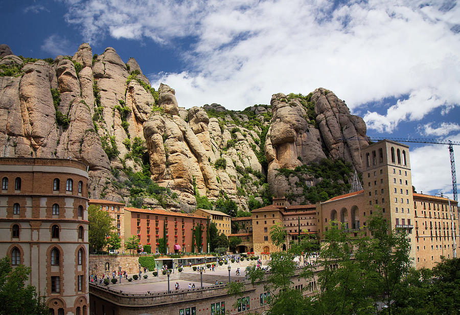

After teh visit at Montserrat we will take the bus again to go to *Mirador de les Caves*, the restaurant where we will have the lunch. 
This restaurant is located only 15-20 minutes from the mountain, in the middle of the nature and views facing to Montserrat mountain. 

They feature a Mediterranean cuisine with first-hand products. As is located in the middle of the nature and wineyards the decoration is really inspired in this. 

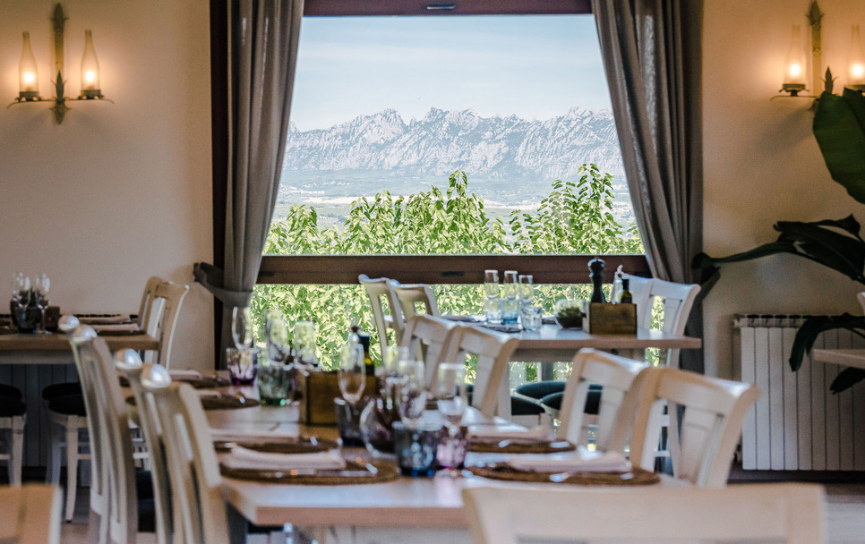

<div class="budget">

<p> Including. 
  <ul>
   Russian speaking guide for the whole day: 500€ VAT incl.
   
   Tickets entrance to Montserrat Abbey, museum and audiovisuals: 18€ VAT incl.
   
   50 seater bus at disposal 6 hours for Montserrat activity: 570€ VAT incl.
   
   Whispers: 3,5€ VAT incl.
   
   Lunch menu at Mirador de les Caves (Starters to share, main course to choose, dessert and 1/3 wine per person and water. Coffee included). Rates from: 45€ VAT incl.
</p>

</div>

<br>

### Sailing activity (Barquentine)

Sail throughout the Mediterranean sea in a pirate boat! 
Guests will enjoy of a pleasant sailing along Barcelona's coastline in this magnificant 35 metres long boat madde up by the Royal family of England. Its the ideal boat for smaller groups up to 65 people. 

This boat features: outdoor saloon, indoor dining room, jacuzzi and sound and music system.

As well as sailing, guests will enjoy of a BBQ lunch on board with an open bar during all the activity (soft drinks, water, coffee and teas).

*There are different options for lunch, like tapas menu or cocktail menu)*

* **Location** Barcelona Port (starting point)
* **Duration** 4 hours
* **Capacity** Up to 65 people
* **Included** Rental of the boat for 4 hours, glass of cava and snacks, Barbacue on board for lunch, open bar (water, soft drinks, coffee and tea)

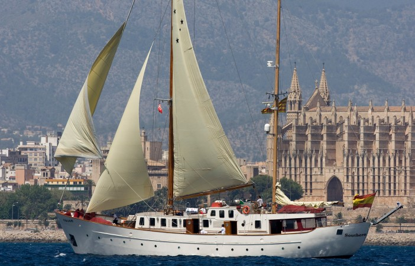


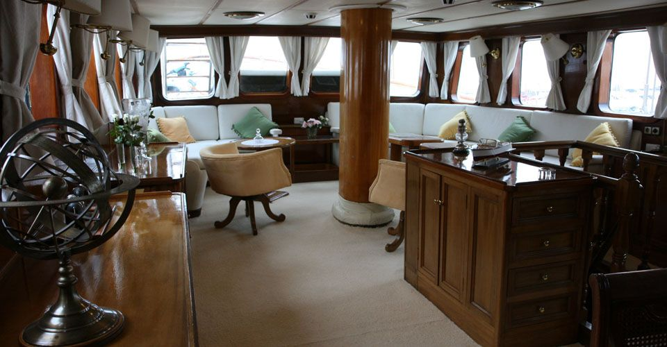


<div class="budget">

<p> Including. 
  <ul>
   Russian speaking assistance (optional): 250€ VAT incl.
   
   Boat reantal for 4 hours. It includes a welcome drink and snacks: 4700€ VAT incl.
   
   Open bar during the sailing (Not alcoholic drinks; water, soft drinks, coffee and tea): 15€ per hour VAT incl
   
   Lunch at boat. barbacue menu (Starters to share, meat to choose and dessert). Rates from: 60€ per person VAT incl.
   
   lunch at boat. Tapas menu (9 dishes to share): 54€ per person VAT incl.
   
   50 seater bus transfer fom hotel to Barcelona port: 218€ VAT incl.
   
   50 seater bus transfer from Barcelona port to the hotel: 218€ VAT incl. 
</p>

</div>

<br>

### La Roca village shopping experience

La Roca Village is the main shopping spot in Catalonia.This shopping center features more than 140 shops and more than 160 clothing brands! The place is a large street that simulates an samll town, full of small squares with trees and *small houses* filled with all kind of clothes! Besides the shopping experience it is also a claim for the tourists because as we told, it is a really nice place to visit and shopping!

**Our clients will have free access  VIP Lounge and will be received with a glass of cava and VIP discount** 

Guests will have fre time to spend their money with the most fashion clothes during 2 hours. After this, we will go back to the hotel for lunch. 

* **Location** La Roca del Vallès (30 km from Barcelona)
* **Duration** 3 hours  
* **Capacity** No capacity fixed 
* **Included** Bus at disposal for the activity, English speaking assistance, VIP discounts at shops, glass of cava at VIP lounge.


<br>

<div class="budget">

<p> Including. 
  <ul>
   Russian speaking assistance: 250€ VAT incl.
   
   Bus at disposal 5 hours for La Roca Village shopping experience: 446€ VAT incl.
   
   VIP services: TBC
</p>

</div>

### Winery visit - Abadal winery

This winery is located really close to Montserrat Mountains, at Penedés area.

The activity will start with private tour of the **Masia Roqueta farmhouse**, which dates back to the **XII century**. The group will go deep into the basement of the house and explore its old cellar, which has been restored to its original state. It is the jewel in the crown of wine history and culture in this region. It is a tour that will take the group back in time. 

After this a **private tour of the winery and the wine-ageing cellar** where Abadal wines are made today and a uided tasting session of high-end Abadal wines. And we will finish the activity with a lunch in an exclusive venue. 

After the lunch, we will take our bus, which transfer the group back to Barcelona 

* **Location** Near to Manresa (40 km from Barcelona) at Penedés area.
* **Duration** 5 hours
* **Capacity** No capacity fixed
* **Included** Bus at disposal for the activity, winery visit, rental for lunch space, lunch menu, Russian speaking assistance.


<br>


<div class="budget">

<p> Including. 
  <ul>
   Russian speaking assistance: 500€ VAT incl.
   
   Visit to the winery with wine tasting: 19€ VAT incl.
   
   Space rental in exclusivity for the lunch: 1100€ VAT incl.
   
   50 seater bus at disposal 6 hours for the activty: 655€ VAT incl.
   
   Lunch menu (Starters to share, main course to choose, dessert and 1/3 wine per person and water. Coffee included). Rates from: 49€ VAT incl.
</p>

</div>

<br>


## Suggested venues for Gala dinner{.tabset .tabset-fade .tabset-pills}

Asa venue for the Gala dinner we suggest you 3 different options. Two of them are out of the hotel and, honestly, are two really good spots where a Gala dinner can be celebrated. 
The third option is in th ehotel, in a private room in exclusivity for the group. 

### La Pedrera {.tabset .tabset-fade}

We suggest La Pedrera as a main option.
During the Gala dinner we would divide the event in two different rooms. 
La Pedrera has a plenty of rooms to celebrate events or dinners, but the ones that fits better to this group are "Lateral Auditori" and "Sala Gaudí".

As told, we will divide the event in two parts (the dinner and the dance with DJ) and in two different rooms (Sala Lateral Auditori and Sala Gaudí). Both rooms are adjoining. 

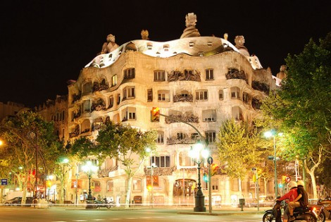

***The dinner***

The dinner will take place at *Sala Lateral Auditori*, the room located just behind the Auditorium. 
It can fit a group up to 50 people in sitted set up (banquet) and 110 in a cocktail set up. As is a Gala dinner is preferible doing as a banquet set up. 

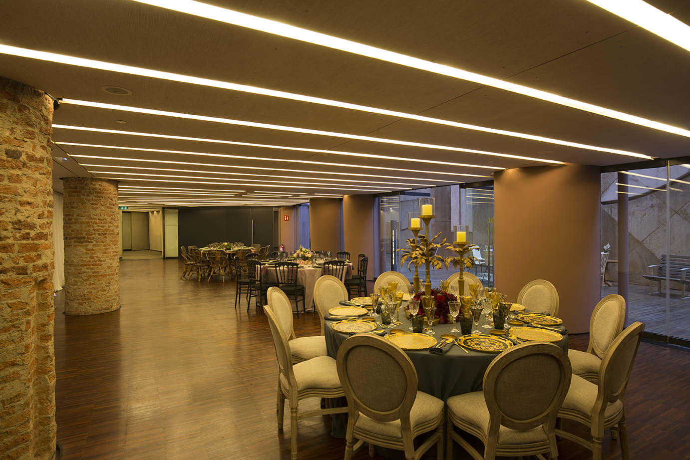

During the dinner there will be some entertainment shows. We have two different options to choose, but we can have both to play in different moments of the night (maybe one of them at the beggining of the event and the other one at the end, before we turn into a "club"). The two options are:

* **Rumba Catalana band show** 

Traditional Rumba catalana group. 2 dancers and 3 musics. 

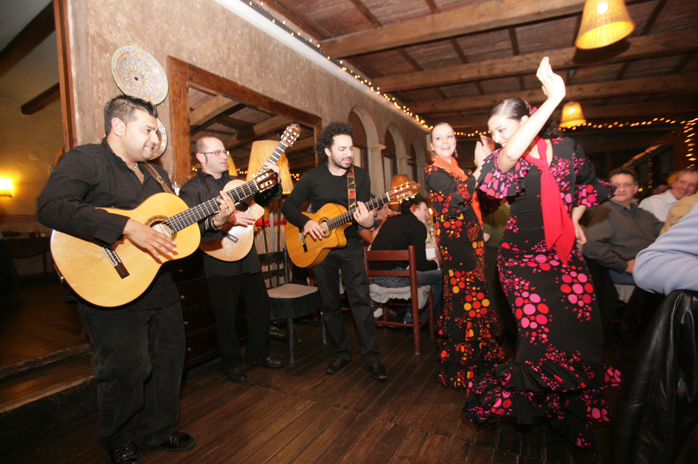

* **Cover band**

Nikol Collars Quartet. They play, lounge, chill and cover songs 

<iframe src="coverband.mp4"  frameborder="0" width="100%" height="480" scrolling="no"></iframe>

<br>

***The dance with DJ***

This will take place in the order room we talked about before, the *Sala Gaudí*.

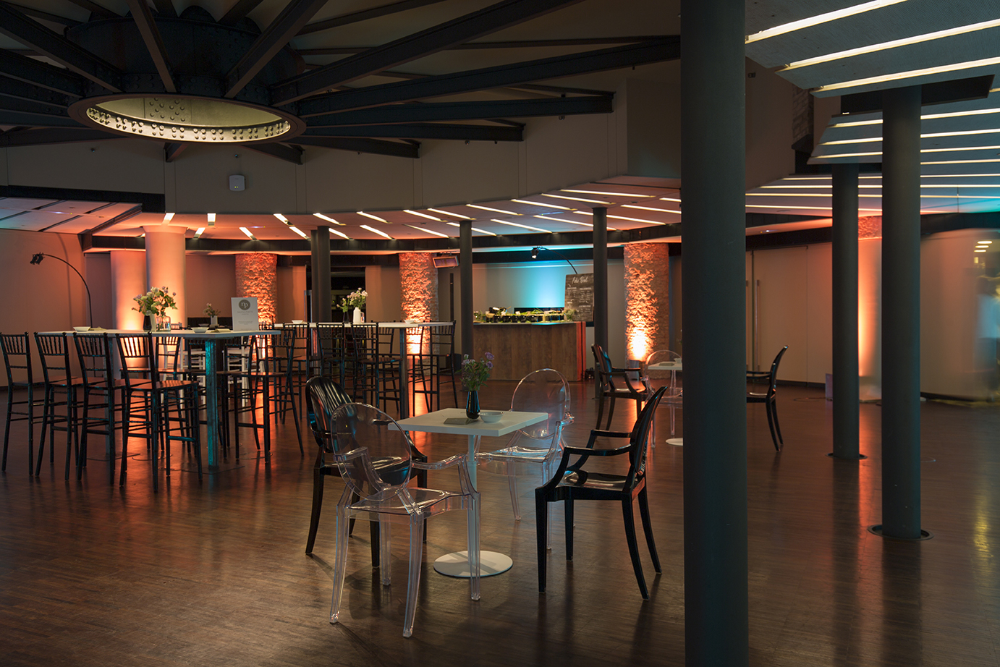

<br>

<div class="budget">

<p> Including. 
  <ul>
   Sala Lateral Auditori rental. Including set up montage, cleaning service and security service. (19h to 00h):1550€ VAT incl.
   
   Sala Gaudí rental Including set up montage, cleaning service and security service. (19h to 00h): 3200€ VAT incl.
   
   Welcome drink and aperitive. Rates from: 8,5€ VAT incl. 
   
   Dinner menu (special Gala dinner) 3 main courses and drinks included (1/3 wine per person, cava and water and coffee and tea). Rates from: 91€    VAT incl.

   Russian speaking assistance (optional): 550€ VAT incl.
   
   Entertainment: cover band Nikol Kollars Quartet (1h30' concert): 4450€ VAT incl.
   
   Entertainment: Rumba Catalana Show (1 hour show): 2500€ VAT incl. 
   
   Stage (4x3 meters): 510€ VAT incl.
   
   Red Carpet (aproximately): 250€ VAT incl.
   
   Sound system during the entertainment (6 speakers, 2 PS Amp, 1 mixer and 1 standing wiring): 800€ VAT incl.
   
   Micro wireless: 90€ VAT incl.
   
   Sala Gaudí: light system: 1815€ VAT incl.
   
   Sala Gaudí: sound system during 3 hours of DJ (4 high speakers, 2 Amplificators, 1 set DJ basic, 1 micro, wires, color effects, 2 crystal balls, smoke machine, 1 DJ): 2200 VAT incl.
   
   Technicians: 1 sound technician and 1 light technician: 1250€ VAT incl.
   
   Transportation of all the material to the spot: 340€ VAT incl.  
   
   Bus at disposal for the dinner during 6 hours: 800€ VAT incl.
</p>

</div>


### El Liceu - Saló dels Miralls

The Saló dels Miralls (Mirror Hall) has recovered its splendour following meticulous restoration. Historically a relaxation room, it has allegorical paintings on the ceiling and texts referring to art and music, forming a stunning setting for gala dinners.

The Mirror Hall is located inside Barcelona's opera house, the Gran Teatre del Liceu, that was founded on the Rambla in 1847 and has continued over the years to fulfil its role as a culture and arts centre and one of the symbols of the city.

This room can fits up to 150 people in banuqet style and it has 250 sq. meters. 

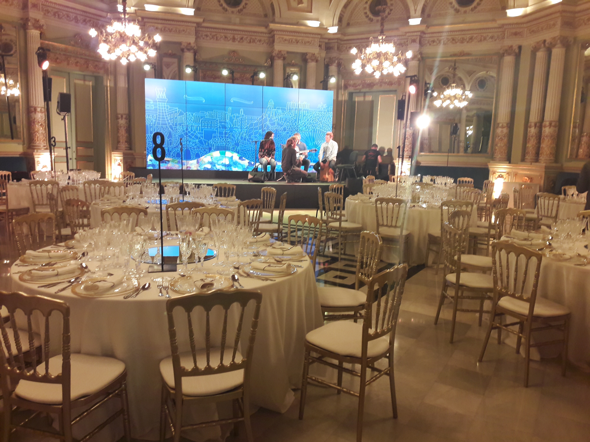

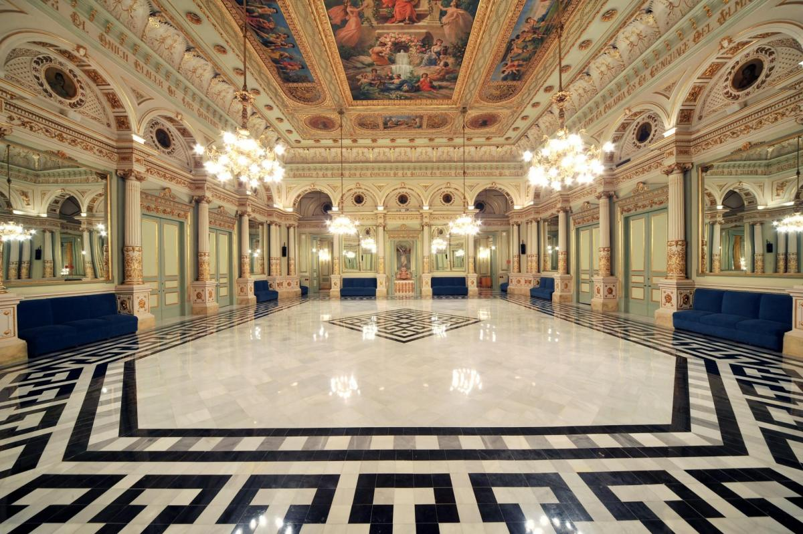

<iframe src=" https://www.liceubarcelona.cat/sites/default/files/liceu360/Miralls/Miralls.html"  frameborder="0" width="100%" height="480" scrolling="no"></iframe>

<br>

In the following map you'll be able to see in which part this room is located respcet the main auditorium, as well as the size from point to point of the room

<iframe src=" mirallsmap.pdf"  frameborder="0" width="100%" height="480" scrolling="no"></iframe>

<div class="budget">

<p> Including. 
  <ul>
   Russian speaking assistance: 550€ VAT incl.
   
   Saló dels Miralls space rental for the whole evening (19h to 03h). Including basic audiovisuals, security service, cleaning service, guardarobe: 8780€ VAT incl.
   
   Dinner menu at Saló dels Miralls Liceu. 3 main courses including drinks (1/3 wine per person, cava and water, coffe and tea): 95€ VAT incl. 
   
   Bus at disposal for the whole evening (19h-03h): 900€ VAT incl. 
</p>

</div>


### Majestic hotel

The last option we suggest you for this Gala dinner is in the hotel Majestic , as we suggest this hotel as the main option. 

The event wouldn't take part in the regular dining room of the hotel but in a private room in exclusivity for the group. This room is perfect to host this event, as we can do the dinner and the dance with the DJ in the same spot. 

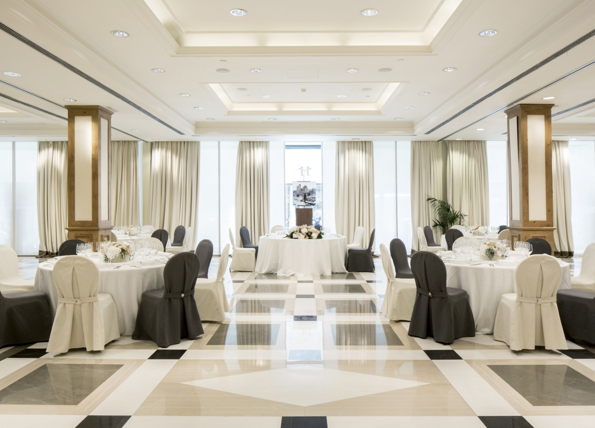

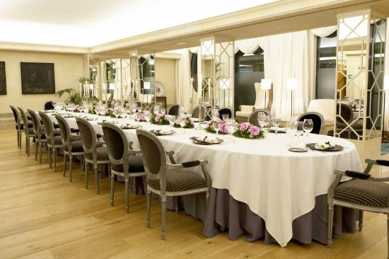

<div class="budget">

<p> Including. 
  <ul>
   Russian speaking assistance: 550€ VAT incl.
   
   Space rental for exclusivity during the dinner and the dance with the DJ: 780€ VAT incl.
   
   Dinner gala menu at Majestic hotel (Kind of menu TBC. Drinks included). Menus from: 98€ VAT incl. 
</p>

</div>


*****

## Terms & Conditions

  * Some of rates are valid for 2019. Could increase 2% or 3%
  
  * Net rates for client
  
  * For a group of minimum 40 pax.
  
  * Cutting Edge Events management fee including in the detailed rates
  
  * VAT included. 
  
  * No reservation has been done. Availability upon request.

## Amaze your clients!!

<div class="client_offer">

<p>Didn't you just love our presentation ? Our first goal here at _**Cutting Edge Events**_ is to help you **win** this business. You will most likely now collate the information contained in this website and make your own presentation
to show your client<br>

<p>Why not leverage our technology, and present your client with the same format ? As a **totally free service**, we offer you the possibility of doing the work for you</p>

<p> We will: 
  <ul>
    * Follow your instructions to add anything you want to be in your presentation, and delete anything that you don't consider relevant
    * Include your logo and company details, and remove all our company details
    * We can even change some colors to mimic your corporate identity
    * We will send you the new link, and it will look as if it was your work
  </ul>
</p>
</div>

<style>

.client_offer{
background-color: blue;
color: white;
padding: 10px;
border: 1px solid black;
margin-left: 25px;
border-radius: 5px;
font-style: italic;
}
</style>

******************


